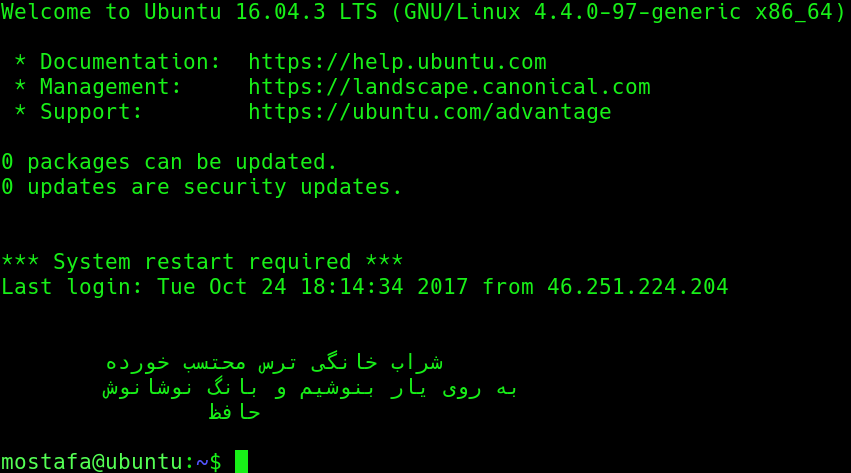

<div dir="rtl">

# sabooh
## صبوح ،‌می صبحگاهی را گویند
### صبوح در هر نشست شما را مهمان یک شعر می‌کند


## نصب
برای نصب خودکار در پوسته بش از دستور 
```
bash <(curl -s https://raw.githubusercontent.com/mostafaasadi/sabooh/master/sabooh_installer.sh)
```
و برای پوسته زی‌شل از دستور 
```
zsh <(curl -s https://raw.githubusercontent.com/mostafaasadi/sabooh/master/sabooh_installer.sh)
```
و همچنین برای نصب بصورت دستی
```
git clone https://github.com/mostafaasadi/sabooh
cd sabooh 
sudo chmod +x sabooh
sudo cp sabooh /usr/bin/
```
و در نهایت دستور `sabooh` را در استارت‌اپ لاگین شل قرار دهید
 برای حذف هم
```
bash <(curl -s https://raw.githubusercontent.com/mostafaasadi/sabooh/master/sabooh_uninstaller.sh)
zsh <(curl -s https://raw.githubusercontent.com/mostafaasadi/sabooh/master/sabooh_uninstaller.sh)
```

## شاعر
پیش‌فرض شعری از لسان الغیب حافظ شیرازی انتخاب خواهد شد ، برای تغییر آن در فایل زیر خط ۵ را با موارد دلخواه تغییر دهید

`/usr/bin/sabooh`

(1) همه شاعران

حافظ (2)

خیام (3)

مولوی (5)

سعدی (7)

اوحدی (19)

خواجو (20)

عراقی (21)

صائب (22)

هاتف اصفهانی (25)

ابوسعید ابوالخیر (26)

باباطاهر (28)

محتشم کاشانی (29)

سیف فرغانی (31)

فروغی بسطامی (32)

عبید زاکانی (33)

امیرخسرو دهلوی (34)

شهریار (35)

سلمان ساوجی (40)

رهی معیری (41)
 </div>
